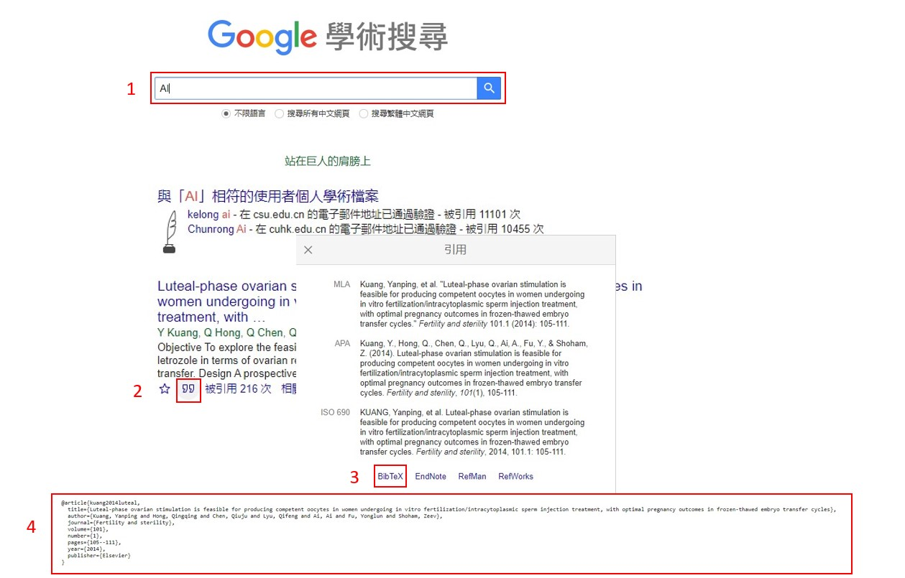

# 此樣板為參考[NTU](https://github.com/tzhuan/ntu-thesis)、[NCTU](https://github.com/hungys/nctu-thesis-latex)、[NCKU](https://github.com/wengan-li/ncku-thesis-template-latex)以及[NKUST](https://github.com/yuhao-kuo/NKUST-thesis-template)之架構，整合為輕量且使用者易上手的樣板

## 定義的資料夾結構如下
```
.
├── fonts
│   └── ...                                 =>  此目錄放置了此專案使用到的字型
├── figures
│   └── ...                                 =>  此目錄可以放置論文所使用的圖片
├── chapters
│   └── ...                                 =>  此目錄放置的是論文內文
├── instance
│   └── ...                                 =>  此目錄放置的是目錄頁前的頁面
├── templates
│   └── ...                                 =>  此目錄放置論文使用的package、package設定以及版面設定
│ 
├── reference.bib                           =>  參考文獻
│ 
├── NKUSTthesis.cls                         =>  該樣板所用格式定義
├── Thesis_Info.tex                         =>  填寫論文作者、指導教授......相關資料
├── Thesis_Config.tex                       =>  修改論文相關設定
├── thesis.tex                              =>  該論文結構定義檔
│ 
├── Makefile                                =>  make執行指令
└── docs
    └── ...                                 =>  此目錄放置此樣板以及LaTex的說明手冊
```

***快速上手本樣板只須閱讀 [執行指令](#執行指令) 以及 [撰寫內容](#撰寫內容) 後運行即可，其餘圖片、公式以及引用等等......語法不熟悉者請看[這邊](docs/SAMPLE.md)***。
---

## 環境安裝
```
sudo apt update
sudo apt-get install texlive texlive-base texlive-xetex texlive-lang-chinese texlive-bibtex-extra biber texlive-science texlive-fonts-extra libsynctex-dev chktex
```

## 執行指令
```
$ make clean
$ make
```

- `make` 進行編譯。
- `make clean` 清除編譯檔案。
- `make clean-all` 清除編譯檔案包含 thesis.pdf。

- 其中 `make` 進行編譯還可以加入兩個參數分別是 `APPROVAL=1` 以及 `WATERMARK=1`，前者為加入口試委員已簽名之審定書；後者為加入背景浮水印，詳情請參閱 `Makefile`。
- 另外，使用 `APPROVAL=1` ***須確認 `pdf` 資料夾下有 `approval.pdf` 檔案才不會出錯***
```
# 加入中英文審定書以及浮水印
$ make APPROVAL=1 WATERMARK=1

# 只加入英文審定書
$ make APPROVALEN=1

# 只加入中文審定書
$ make APPROVALZH=1

# 只加入浮水印
$ make WATERMARK=1

# 只加入初稿
$ make DRAFT=1
```


## 撰寫內容

### figures
> 裡面可依自己喜好放置圖片目錄，以便引用。而 `watermark.png` 是論文浮水印；`logo.png` 是論文封面 Logo。
### chapters
> 此目錄為論文內文。
- `introduction.tex` 為第一章，緒論。
- `background.tex` 為第二章，相關文獻探討。
- `design.tex` 為第三章，所提出之方法。
- `implementation.tex` 為第四章，實現之步驟。
- `evaluation.tex` 為第五章，實驗評估。
- `conclusion.tex` 為第六章，結論與未來展望。
### abstract.tex 與 acknowledgements.tex
> 此兩個檔案為論文摘要與誌謝。
- `abstract.tex` 為摘要。
- `acknowledgements.tex` 為誌謝。
### reference.bib
> 此檔案為論文參考文獻來源。
```script=biber
@article{kuang2014luteal,
  title={Luteal-phase ovarian stimulation is feasible for producing competent oocytes in women undergoing in vitro fertilization/intracytoplasmic sperm injection treatment, with optimal pregnancy outcomes in frozen-thawed embryo transfer cycles},
  author={Kuang, Yanping and Hong, Qingqing and Chen, Qiuju and Lyu, Qifeng and Ai, Ai and Fu, Yonglun and Shoham, Zeev},
  journal={Fertility and sterility},
  volume={101},
  number={1},
  pages={105--111},
  year={2014},
  publisher={Elsevier}
}
```

- 上述來源文字只須在Google Scholar搜尋所需查找之論文，
並點選兩個逗號的圖標(Cite)，再點選BibTeX就會出現，不須自己手動輸入。
    


- 引用方式為`cite{kuang2014luteal}`

---
## 設定檔案 (釐清框架結構)

### fonts
> 該目錄可以依據需求自行加入所需要之字體，但須額到`templates/template.tex`設置。
- `kaiu.ttf` 為正常字體，楷書。
    - 由於 NKUSTthesis.tex 裡面沒有額外定義其他斜體、粗體、粗斜體，因此使用 LaTeX 內建AutoFake自動生成。
- `mingliu.ttc` 為正常字體，新細明體。
- `mingliub.ttc` 為粗體，新細明體。
- `times.ttf` 為正常字體，Times New Roman。
- `timesi.ttf` 為斜體，*Times New Roman*。
- `timesbd.ttf` 為粗體，**Times New Roman**。
- `timesbi.ttf` 為粗斜體，***Times New Roman***。

### NKUSTthesis.tex
> 該論文樣本所依賴之類別，涵蓋所有用到之 package、自定義指令、環境等等。

### thesis.tex
> 論文結構順序，涵蓋 封面、書名、審定書、摘要、誌謝、目錄、表目錄、圖目錄、內文以及參考文獻。
- 其中 `封面` 、 `書名`、 `審定書` 、`摘要` 以及 `致謝` 皆放在在 `instance`。
    - booktitle.tex
    - titlepage.tex
    - approval.tex
    - abstract.tex
    - acknowledgements.tex
- 而 `摘要` 、 `誌謝` 是以環境命令定義於 `NKUSTthesis.tex`，使用在 `abstract.tex` 與`acknowledgements.tex`。
    - \abstractzh & \abstracten
    - \acknowledgements
- 此外， `目錄` 、 `表目錄` 以及 `圖目錄` 皆為LaTeX內建指令，皆使用於 `thesis.tex`。
    - \tableofcontents
    - \listoftables
    - \listoffigures
