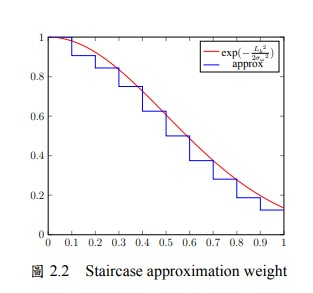

# 語法使用指南

## 常用指令
| 指令 | 說明 |
|------|------|
| `\\` | 換行 |
| `\par`| 新段落 (自動空兩格) |
| `\clearpage` | 新頁面 (強制換頁) |
| `\uline{}` | 文字下劃線|
| `\ref{}` | 所有的 `\label{}` 填入的內容皆可引用 |
| `\cite{}` | 所有打在 `reference.bib` 的內容皆可引用 |
| 公式 | 請查閱 [公式](#公式) |
| 圖片 | 請查閱 [圖片](#圖片) |
| 繪圖 | 請查閱 [繪圖](#繪圖) |
| 演算法 | 請查閱 [演算法](#演算法) |
| 表格 | 請查閱 [表格](#表格) |
|||


## 公式
### 常用數學式
| 指令 | 說明 |
|------|------|
|`\log`| 對數 |
|`\exp`| 以e為底指數 |
|`\times`| 乘法符號(x) |
|`\cdot`| 乘法符號(·) |
|`\frac{}{}`| 分數，前括弧內為分子，後括弧內為分母 |
|`\left(`、`left[`| 左括弧 (打指令與直接打符號的差異在於打指令會有獨立空白相對在公式內比較好看) |
|`\right)`、`\right]`| 右括弧 (同上) |
|`\alpha`| 希臘字母 α |
| `\mathop{\arg\min}`| argmin|
| `\mathop{\arg\max}`| argmax|

### 行內公式 (與文字一同排列，亦即在文章內提到公式)
```
$x^y$表示$x$的$y$次方
```


- `$x^y$`，使用兩個錢號即為使用行內公式表達，通常用來文章內說明變數做使用， 
- 另外，`^` 表示為上標(指數)，也可使用 `_` (底線)表示下標 $x_y$


### 單行公式
```
\begin{equation}\label{eq:proposed normalize}
  L_{\log}\left(x,y\right) = \frac{\log_2\left(L_{in}\left(x,y\right) + 1\right)}{\log_2\left(\alpha + 1\right)}
\end{equation}
```


### 單行公式 (複合條件)
```
\begin{equation}\label{eq:calculate gamma}
    \left\{
        \begin{array}{ll}
            \gamma_L = \mathop{\arg\min}\limits_{\gamma_i} \left(\left|med\left(S_{dark}^{\gamma_i}\right) - M_L \right|\right), & \gamma_i \in \left\{0.1,0.11,...,1\right\} \\
            \gamma_H = \mathop{\arg\min}\limits_{\gamma_i} \left(\left|med\left(S_{bright}^{\gamma_i}\right) - M_H \right|\right), & \gamma_i \in \left\{1,1.1,...,10\right\}
        \end{array}
    \right.
\end{equation}
```


### 單行公式 (多項對齊)
```
\begin{equation}\label{eq:proposed linear approx weight}
  \begin{aligned}
  \left\{
      \begin{array}{ll}
          \omega_1 = -0.1953125 * L_b + 0.99973125, & L_b  \in \left[0,0.1\right) \\
          \omega_2 = -0.75 * L_b  + 1.0552, & L_b  \in \left[0.1,0.3\right) \\
          \omega_3 = -1.125 * L_b  + 1.1728, & L_b \in \left[0.3,0.5\right) \\
          \omega_4 = -1.125 * L_b  + 1.1628, & L_b  \in \left[0.5,0.7\right) \\
          \omega_5 = -0.875 * L_b + 0.9878, & L_b \in \left[0.7,0.85\right) \\
          \omega_6 = -0.65625 * L_b + 0.79155, & L_b  \in \left[0.85,1\right]
      \end{array}
  \right. \\
  \end{aligned}
\end{equation}
```


### 多行公式對齊 (等號會在相同位置)
```
\begin{align}
  L_{Lin}\left(x,y\right) &= \log_2\left(L_{in}\left(x,y\right) + 1\right) \label{eq:proposed log2 luminance} \\
  L_{alpha} &= \log_2\left(\alpha + 1 \right) \label{eq:proposed log2 max luminance}
\end{align}
```


- `&=`，在等號左邊必須加上&

## 繪圖

### 單一公式曲線
```
\begin{figure}[h!]
  \centering
    \begin{tikzpicture}[scale=0.7]
    \begin{axis}[
        xmin=0,
        xmax=1,
        ymin=0,
        ymax=1,
        xtick={0,0.1,...,1},
        %ytick={0,0.1,...,1},
        domain=0:1,
        samples=1000,
        width=0.7\textwidth
    ]
        \addplot[color=red] {exp(-(x^2)/(2*(0.5)^2))};
        \addlegendentry{$\exp(-\frac{{L_b}^2}{2{\sigma_\omega}^2})$}
    \end{axis}
    \end{tikzpicture}
  \caption{Staircase approximation weight}
  \label{figure:staircase weight approximation}
\end{figure}
```


### 階梯近似圖
```
\begin{figure}[h!]
  \centering
    \begin{tikzpicture}[scale=0.7]
    \begin{axis}[
        xmin=0,
        xmax=1,
        ymin=0,
        ymax=1,
        xtick={0,0.1,...,1},
        %ytick={0,0.1,...,1},
        domain=0:1,
        samples=1000,
        width=0.7\textwidth
    ]
        \addplot[color=red] {exp(-(x^2)/(2*(0.5)^2))};
        \addlegendentry{$\exp(-\frac{{L_b}^2}{2{\sigma_\omega}^2})$}
        \addplot+[const plot, no marks, thick,color=blue] coordinates{
            (0,1)
            (0.1,0.90625)
            (0.2,0.84375)
            (0.3,0.75)
            (0.4,0.625)
            (0.5,0.5)
            (0.6,0.375)
            (0.7,0.28125)
            (0.8,0.18725)
            (0.9,0.125)
            (1,0.125)
        };
        \addlegendentry{approx}
    \end{axis}
    \end{tikzpicture}
  \caption{Staircase approximation weight}
  \label{figure:staircase weight approximation}
\end{figure}
```



### 多條線性近似圖
```
\begin{figure}[h!]
    \centering
    \begin{tikzpicture}[scale=0.7]
        \begin{axis}[
            xmin=0,
            xmax=1,
            ymin=0,
            ymax=1,
            xtick={0,0.1,...,1},
            %ytick={0,0.1,...,1},
            domain=0:1,
            samples=1000,
            width=0.7\textwidth
        ]
        \addplot[color=red] {exp(-(x^2)/(2*(0.5)^2))};
        \addlegendentry{$\exp(-\frac{{L_b}^2}{2{\sigma_\omega}^2})$}
        \addplot[color=blue,domain=0:0.1]{-0.1953125 * x + 0.99973125};
        \addplot[color=blue,domain=0.1:0.3]{-0.75 * x + 1.0552};
        \addplot[color=blue,domain=0.3:0.5]{-1.125 * x + 1.1728};
        \addplot[color=blue,domain=0.5:0.7]{-1.125 * x + 1.1628};
        \addplot[color=blue,domain=0.7:0.85]{-0.875 * x + 0.9878};
        \addplot[color=blue,domain=0.85:1]{-0.65625 * x + 0.79155};
        \addlegendentry{approx}
        
    \end{axis}
    \end{tikzpicture}
  \caption{Linear approximation weight}
  \label{figure:linear weight approximation}
\end{figure}
```


## 圖片
### 嵌入單張圖片
```
\begin{figure}[h!]
    \centering
    \includegraphics[width=\linewidth]{background/lena.png}
    \caption{1$\times$1}
    \label{figure:lena512}
\end{figure}
```


- 其中 `\centering` 是設定圖像置中。
- `width=\linewidth`為不超出論文左右邊界範圍，另外可依據喜好替換為 `scale=0.7` 縮放圖像大小， `0.7` 可自行修改數值，而後面 `{background/lena.png}` 設定為圖像具體所在位置，由於在 `NKUSTthesis.tex` 裡面已經定義圖片的起始目錄為`./figures/`，因此這邊就不須再重複一次 ( ~~{./figures/background/lena.png}~~ )。
- `\caption` 圖片標題。
- `\label` 圖片標籤用來連結 ( `\ref` ) 使用。

### 嵌入多張圖片 ( 3 x 1 )
```
\begin{figure}[h!]
    \centering
    \subfloat[image 1]{
        \label{subfigure:image 1}
        \includegraphics[scale=0.2]{background/lena.png}
    }
    \hspace{0.1cm}
    \subfloat[image 2]{
        \label{subfigure:image 2}
        \includegraphics[scale=0.2]{background/lena.png}
    }
    \hspace{0.1cm}
    \subfloat[image 3]{
        \label{subfigure:image 3}
        \includegraphics[scale=0.2]{background/lena.png}
    }
    \caption{3$\times$1}
    \label{figure:3x1}
\end{figure}
```


- 其中 `\subfloat[image 1]` 中括號內為圖片標題。
- `\hspace{0.2cm}`為水平距離 `0.2cm` ，請依據圖像實際縮放大小進行調整。

### 嵌入多張圖片 ( 1 x 3 )
```
\begin{figure}[h!]
    \centering
    \subfloat[image 1]{
        \label{subfigure:image 1}
        \includegraphics[scale=0.3]{background/lena.png}
    }
    \vskip\baselineskip
    \subfloat[image 2]{
        \label{subfigure:image 2}
        \includegraphics[scale=0.3]{background/lena.png}
    }
    \vskip\baselineskip
    \subfloat[image 3]{
        \label{subfigure:image 3}
        \includegraphics[scale=0.3]{background/lena.png}
    }
    \caption{1$\times$3}
    \label{figure:1x3}
\end{figure}
```


- `\vskip\baselineskip`為垂直換行。

### 嵌入多張圖片 ( 1 x 9 ) 跨頁顯示
```
\begin{figure}[h!]
    \centering
    \subfloat[image 1]{
        \label{subfigure:image 1}
        \includegraphics[scale=0.3]{background/lena.png}
    }
    \vskip\baselineskip
    \subfloat[image 2]{
        \label{subfigure:image 2}
        \includegraphics[scale=0.3]{background/lena.png}
    }
    \vskip\baselineskip
    \subfloat[image 3]{
        \label{subfigure:image 3}
        \includegraphics[scale=0.3]{background/lena.png}
    }
    \caption{1$\times$9}
    \label{figure:1x9}
\end{figure}
\begin{figure}[h!]\ContinuedFloat
    \centering
    \subfloat[image 4]{
        \label{subfigure:image 4}
        \includegraphics[scale=0.3]{background/lena.png}
    }
    \vskip\baselineskip
    \subfloat[image 5]{
        \label{subfigure:image 5}
        \includegraphics[scale=0.3]{background/lena.png}
    }
    \vskip\baselineskip
    \subfloat[image 6]{
        \label{subfigure:image 6}
        \includegraphics[scale=0.3]{background/lena.png}
    }
    \caption{1$\times$9 (cont.)}
\end{figure}
\begin{figure}[h!]\ContinuedFloat
    \centering
    \subfloat[image 7]{
        \label{subfigure:image 7}
        \includegraphics[scale=0.3]{background/lena.png}
    }
    \vskip\baselineskip
    \subfloat[image 8]{
        \label{subfigure:image 8}
        \includegraphics[scale=0.3]{background/lena.png}
    }
    \vskip\baselineskip
    \subfloat[image 9]{
        \label{subfigure:image 9}
        \includegraphics[scale=0.3]{background/lena.png}
    }
    \caption{1$\times$9 (cont.)}
\end{figure}
```


- 跨頁顯示圖片中，此範例有組 `\begin{figure}...\end{figure}`，其中只有第一組需要加上 `\label` 才能夠引用，其他就不必添加，另外其餘兩組必須在 `\begin{figure}` 添加 `\ContinuedFloat` 告訴它這些圖是連續的，裡面標示小圖順序的字母才不會斷掉。

### 卷積核心
```
\subsection{卷積核心}
\begin{figure}[h!]
    \centering
    \label{subfigure: DoG kernel}
    \begin{tikzpicture}
        \matrix[matrix of nodes,
            nodes = {draw, 
            % minimum size=8mm, 
            minimum height=15mm, 
            minimum width=15mm, 
            anchor=center, 
            inner sep=0pt, 
            outer sep=0pt},
            column sep=-\pgflinewidth,
            row sep=-\pgflinewidth,
            ampersand replacement=\&
            ]
        {
        -0.0834 \& -0.0345 \& -0.0834 \\
        -0.0345 \& 0.4716 \& -0.0345 \\
        -0.0834 \& -0.0345 \& -0.0834 \\
        };
    \end{tikzpicture}
    \caption{DoG kernel}
    \label{figure: DoG kernel}
\end{figure}
```


### 演算法
```
\begin{figure}[h!]
    \begin{algorithm}[H]
        \caption{Weight approximation}
        \begin{algorithmic}[2]
            \Procedure{GetApproxWeight}{$L_b$}
                \If{$L_b < 0.1$}
                    \State \textbf{return} $\omega_1$
                \ElsIf{$L_b < 0.3$}
                    \State \textbf{return} $\omega_2$
                \ElsIf{$L_b < 0.5$}
                    \State \textbf{return} $\omega_3$
                \ElsIf{$L_b < 0.7$}
                    \State \textbf{return} $\omega_4$
                \ElsIf{$L_b < 0.85$}
                    \State \textbf{return} $\omega_5$
                \Else
                    \State \textbf{return} $\omega_6$
                \EndIf
            \EndProcedure
        \end{algorithmic}
    \end{algorithm}
    \caption{Pseudo code of GetApproxWeight}
    \label{figure:proposed pseudo code of get approx weight}
\end{figure}
```


## 表格
### 純表格
```
\begin{table}[h!]
    \centering
    \caption{TMQI evaluation}
    \begin{tabular}{ |c|c|c|c| } 
        \hline
        \textbf{} & \textbf{A} & \textbf{B} & \textbf{C} \\
        \hline
        \hline
        1.hdr & 0.212607 & 0.21095 & 0.211777 \\
        2.hdr & 0.212476 & 0.210323 & \uline{0.212685} \\
        3.hdr & 0.211404 & 0.200457 & \uline{0.212222} \\
        4.hdr & 0.212809 & 0.208261 & \uline{0.214778} \\
        5.hdr & 0.210723 & 0.209583 & 0.209901 \\
        6.hdr & 0.219070 & 0.212729 & 0.217276 \\
        7.hdr & 0.209030 & 0.208184 & \uline{0.209042} \\
        8.hdr & 0.211305 & 0.209667 & 0.209747 \\
        9.hdr & 0.214496 & 0.197879 & 0.212993 \\
        10.hdr & 0.211099 & 0.210646 & 0.210721 \\
        11.hdr & 0.214491 & 0.202344 & 0.213535 \\
        12.hdr & 0.215437 & 0.214078 & 0.213959 \\
        13.hdr & 0.212190 & NaN & 0.211220 \\
        14.hdr & 0.210871 & NaN & 0.210620 \\
        15.hdr & 0.219825 & 0.207363 & 0.216147 \\
        \hline
    \end{tabular}
    \label{table: TMQI evaluation}
\end{table}
```


### 搭配引用使用 
```
\begin{table}[h!]
    \centering
    \caption{TMQI evaluation}
    \begin{tabular}{ |c|c|c|c| } 
        \hline
        \textbf{} & \textbf{ALTM Retinex\protect\cite{ahn2013adaptive}} & \textbf{IDRA\protect\cite{yang2018adaptive}} & \textbf{Proposed} \\
        \hline
        \hline
        1.hdr & 0.212607 & 0.21095 & 0.211777 \\
        2.hdr & 0.212476 & 0.210323 & \uline{0.212685} \\
        3.hdr & 0.211404 & 0.200457 & \uline{0.212222} \\
        4.hdr & 0.212809 & 0.208261 & \uline{0.214778} \\
        5.hdr & 0.210723 & 0.209583 & 0.209901 \\
        6.hdr & 0.219070 & 0.212729 & 0.217276 \\
        7.hdr & 0.209030 & 0.208184 & \uline{0.209042} \\
        8.hdr & 0.211305 & 0.209667 & 0.209747 \\
        9.hdr & 0.214496 & 0.197879 & 0.212993 \\
        10.hdr & 0.211099 & 0.210646 & 0.210721 \\
        11.hdr & 0.214491 & 0.202344 & 0.213535 \\
        12.hdr & 0.215437 & 0.214078 & 0.213959 \\
        13.hdr & 0.212190 & NaN & 0.211220 \\
        14.hdr & 0.210871 & NaN & 0.210620 \\
        15.hdr & 0.219825 & 0.207363 & 0.216147 \\
        \hline
    \end{tabular}
    \label{table: TMQI evaluation}
\end{table}
```


